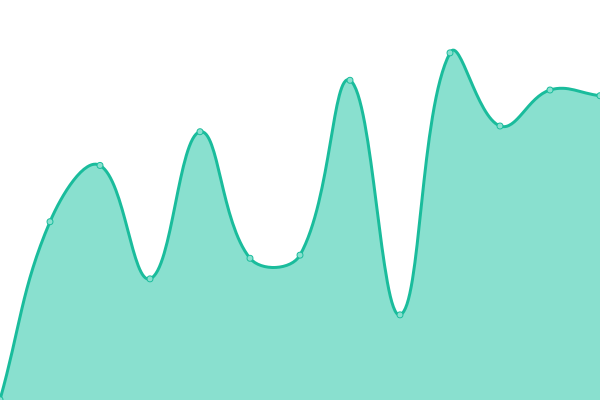
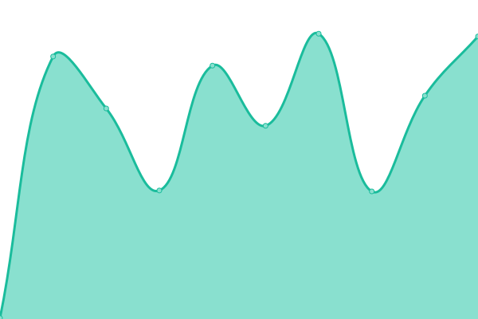

# [📈 Live Status](https://dougdragon.github.io/upptime/): <!--live status--> **🟥 Complete outage**

This repository contains the open-source uptime monitor and status page for [Doug Dragon](http://dougdragon.com), powered by [Upptime](https://github.com/upptime/upptime).

With [Upptime](https://upptime.js.org), you can get your own unlimited and free uptime monitor and status page, powered entirely by a GitHub repository. We use [Issues](https://github.com/dougdragon/upptime/issues) as incident reports, [Actions](https://github.com/dougdragon/upptime/actions) as uptime monitors, and [Pages](https://dougdragon.github.io/upptime/) for the status page.

<!--start: status pages-->
<!-- This summary is generated by Upptime (https://github.com/upptime/upptime) -->
<!-- Do not edit this manually, your changes will be overwritten -->
<!-- prettier-ignore -->
| URL | Status | History | Response Time | Uptime |
| --- | ------ | ------- | ------------- | ------ |
|  [H2Health](https://h2health.org) | 🟥 Down | [h2-health.yml](https://github.com/dougdragon/uptime/commits/HEAD/history/h2-health.yml) | 

 5595ms
     
 | 

<a href="https://dougdragon.github.io/uptime/history/h2-health">99.98%</a>
    

|  [PAH](https://www.pembroke-animal-hospital.com/) | 🟥 Down | [pah.yml](https://github.com/dougdragon/uptime/commits/HEAD/history/pah.yml) | 

 1911ms
     
 | 

<a href="https://dougdragon.github.io/uptime/history/pah">99.66%</a>
    

|  [DD](https://dougdragon.com) | 🟥 Down | [dd.yml](https://github.com/dougdragon/uptime/commits/HEAD/history/dd.yml) | 

 765ms
     
 | 

<a href="https://dougdragon.github.io/uptime/history/dd">99.99%</a>
    

|  [VNUX.dev](https://vnux.dev) | 🟥 Down | [vnux-dev.yml](https://github.com/dougdragon/uptime/commits/HEAD/history/vnux-dev.yml) | 

 313ms
     
 | 

<a href="https://dougdragon.github.io/uptime/history/vnux-dev">99.99%</a>
    

|  [JustBlameBen4Everything](https://justblameben4everything.site) | 🟥 Down | [just-blame-ben4-everything.yml](https://github.com/dougdragon/uptime/commits/HEAD/history/just-blame-ben4-everything.yml) | 

 367ms
     
 | 

<a href="https://dougdragon.github.io/uptime/history/just-blame-ben4-everything">99.83%</a>
    

<!--end: status pages-->

[**Visit our status website →**](https://dougdragon.github.io/upptime)

## 📄 License

- Powered by: [Upptime](https://github.com/upptime/upptime)
- Code: [MIT](./LICENSE) © [Doug Dragon](http://dougdragon.com)
- Data in the `./history` directory: [Open Database License](https://opendatacommons.org/licenses/odbl/1-0/)
